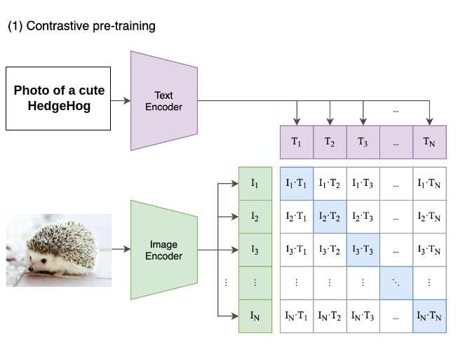

# Hi, I'm Annie! 👋  

Storyteller. Visual creator. Data enthusiast. I turn complex insights into simple, visually compelling stories that make people say, 'Now I get it.'

   
<strong>MEng in Data Science @ UCLA</strong>  A recent UCLA Data Science grad with 5 years of experience in data, specializing in predictive modeling, data visualization, and statistical analysis across multiple domains, including the retail and manufacturing. I'm dedicated to leveraging my skills to help organizations succeed by making strategies accessible and effective.  

Right now, I'm seeking my next move. I invite you to check out my [resume](assets/Annie's Resume.pdf){:target="_blank"} for more details. I'm delighted to be contacted at [LinkedIn](https://www.linkedin.com/in/anniechen091/)/ [Email](anniechen091@gmail.com)/ [GitHub](https://github.com/anniechen091). Let's connect and explore data together!   

   
  
## Something About Me

🍰 Food and travel enthusiast  
🤝 Enjoy meeting new people and exploring new cultures   
💻 Speak fluent Python, SQL, Power BI, and Tableau 

  
  
## Professional Experience

<strong>Sales Data Analyst</strong>, Retail and Ecommerce @ GOOSH INC (06/2023 – Present)
  <ul style="font-family: Calibri; font-size: 12 px; color: black;">
  <li>Analyzed sales and improved performance, contributing to a 20% sales increase.</li>
  <li>Built Power BI dashboards for data-driven decision-making.</li>
	</ul>

  
<strong>Data Scientist</strong>, Manufacturing @ Nan Ya Plastics Corporation (08/2019 – 05/2022) 
  <ul style="font-family: Calibri; font-size: 12 px; color: black;">
    <li>Applied machine learning models to optimize production processes, reducing resource waste by 50%.  
    <li>Led digital transformation initiatives with data visualization tools and robotic process automation techniques.
  </ul>

  

## Projects

<h3 style="font-size: 17px; margin-bottom: 10px;">
    <a href="assets/Anticipating%20Tomorrow%20Predicting%20Radiologist%20Case%20Volumes.pdf" target="_blank">
        Anticipating Tomorrow: Predicting Radiologist Case Volumes
    </a>
</h3>

<strong>Date:</strong> Dec, 2023

In collaboration with Massachusetts General Hospital, this project developed a forecasting system using LightGBM and ensemble models to predict radiologist workloads 1-7 days ahead. With a <10% SMAPE, the system improved healthcare resource allocation, ensuring better staff planning, reducing delays, and enhancing patient care efficiency.

<h3 style="font-size: 17px; margin-bottom: 10px;">
    <a href="https://anniechen091.wixsite.com/anniechen/cod-reduction" target="_blank">
    AI Resource Optimization and Waste Reduction
   </a>
</h3>

<strong>Date:</strong> May, 2022

This project focused on building AI-driven predictive models to optimize production planning in plastic manufacturing. By identifying key factors influencing wastewater pollutants, we reduced COD levels from 45,000 ppm to 30,000 ppm, cutting treatment costs and minimizing environmental impact. This approach improved resource management, reduced waste, and increased production efficiency by 20%.

<h3 style="font-size: 17px; margin-bottom: 10px;">
    <a href="assets/Vectorized Similarity Search in Multi-modal Databases.pdf" target="_blank">
        Vectorized Similarity Search in Multi-modal Databases
    </a>
</h3>

<strong>Date:</strong> Dec, 2023

In this project, we developed a multimodal database using CLIP embeddings to enable text-to-image and image-to-text searches. With kNN and ANN algorithms, it achieved 96% precision on the MS-COCO dataset. The project also included a user-friendly interface built with Streamlit, which allows users to easily perform dynamic searches between text and images, making it quick and easy for users to conduct multimodal AI information retrieval.

<h3 style="font-size: 17px; margin-bottom: 10px;">
    <a href="assets/Anticipating%20Tomorrow%20Predicting%20Radiologist%20Case%20Volumes.pdf" target="_blank">
        Anticipating Tomorrow: Predicting Radiologist Case Volumes
    </a>
</h3>

<strong>Date:</strong> Dec, 2023

The Perceptron Learning Algorithm (PLA) is a fundamental concept in neural network training, providing the groundwork for understanding how single-layer perceptrons learn from input data.

<h3 style="font-size: 17px; margin-bottom: 10px;">
    <a href="assets/Anticipating%20Tomorrow%20Predicting%20Radiologist%20Case%20Volumes.pdf" target="_blank">
        Anticipating Tomorrow: Predicting Radiologist Case Volumes
    </a>
</h3>

<strong>Date:</strong> Dec, 2023

The Perceptron Learning Algorithm (PLA) is a fundamental concept in neural network training, providing the groundwork for understanding how single-layer perceptrons learn from input data.

<h3 style="font-size: 17px; margin-bottom: 10px;">
    <a href="assets/Anticipating%20Tomorrow%20Predicting%20Radiologist%20Case%20Volumes.pdf" target="_blank">
        Anticipating Tomorrow: Predicting Radiologist Case Volumes
    </a>
</h3>

<strong>Date:</strong> Dec, 2023

The Perceptron Learning Algorithm (PLA) is a fundamental concept in neural network training, providing the groundwork for understanding how single-layer perceptrons learn from input data.

<h3 style="font-size: 17px; margin-bottom: 10px;">
    <a href="assets/Anticipating%20Tomorrow%20Predicting%20Radiologist%20Case%20Volumes.pdf" target="_blank">
        Anticipating Tomorrow: Predicting Radiologist Case Volumes
    </a>
</h3>

<strong>Date:</strong> Dec, 2023

The Perceptron Learning Algorithm (PLA) is a fundamental concept in neural network training, providing the groundwork for understanding how single-layer perceptrons learn from input data.

